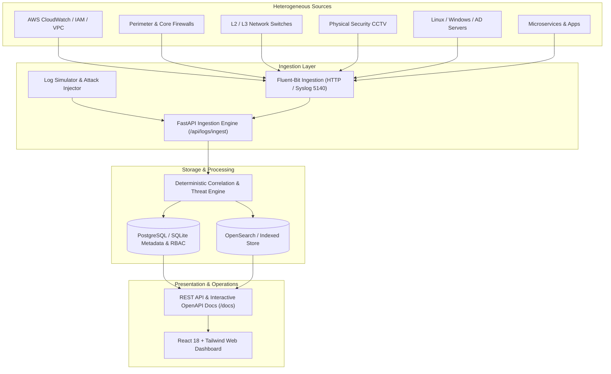

# 🛡️ LogIntel — Centralized Log Intelligence & Threat Monitoring Platform

> **Nexus Hackathon Project**  
> **Team Members**:  
> - Bhavsar Vishv Jigneshkumar (ID: `202201619010239`)  
> - Sojitra Dhruvil Vipulbhai (ID: `202201619010336`)  

---

## 🌟 Overview

**LogIntel** is an enterprise-grade, high-throughput log intelligence, security information, and event monitoring (SIEM) platform designed to ingest, normalize, index, and correlate heterogeneous machine data across modern hybrid environments.

It captures logs across distributed layers—including **AWS CloudWatch/IAM/VPC Flow**, **Perimeter Firewalls**, **Layer-2/Layer-3 Network Switches**, **Physical CCTV Security Cameras**, **Active Directory / Servers**, and **Microservices**—delivering sub-second full-text search, automated threat correlation rules, proactive alert triage, SOC analytics, and immutable audit logs.



---

## 🚀 Key Features

- **Multi-Source Heterogeneous Ingestion**: Unified normalization pipeline supporting AWS, Firewalls, Switches, CCTV cameras, Linux/Windows Servers, and Syslog RFC 5424 / RFC 3164 via UDP & TCP.
- **Deterministic Threat Detection Engine**: Multi-event correlation rules running in real time:
  - *RULE-AUTH-001*: Multi-attempt brute force login anomaly detection
  - *RULE-NET-002*: Multi-port reconnaissance and vertical/horizontal port scan detection
  - *RULE-NET-003*: Excessive perimeter firewall blocked/dropped connections flood
  - *RULE-DEV-004*: Critical infrastructure and switch interface disconnect alerts
  - *RULE-CCTV-005*: Physical camera optical lens occlusion & hardware tampering sabotage
  - *RULE-AWS-006*: Privileged AWS Root console access & unauthorized IAM policy manipulation
- **Interactive SOC Web Dashboard**:
  - Live metric KPI cards (Total Logs, Critical Events, Active Devices, Open Alerts, Blocked Connections, Failed Logins)
  - 24-hour volume trend area chart with severity distribution breakdown
  - Source distribution donut chart & severity distribution matrix
  - Top attacking/suspicious IP address intelligence table
- **Deep Log Explorer**:
  - Full-text search with regex, keyword filtering, source filtering, and severity stratification
  - Time-range sliding window picker (Last 15m, 1h, 24h, 7d, Custom ISO timestamps)
  - JSON metadata inspector modal with single-click payload inspection
- **Incident & Alert Management**:
  - Alert lifecycle workflow (`OPEN` ➔ `ACKNOWLEDGED` ➔ `RESOLVED`)
  - Analyst response notes and resolution tracking
- **Device & Asset Inventory**:
  - Live health monitoring (Online, Warning, Offline) across all network assets
- **Role-Based Access Control (RBAC) & Audit Logs**:
  - Strict separation between `Admin` and `Security Analyst` roles
  - Immutable audit logging recording all rule mutations, triage actions, and user logins

---

## 🔑 Default Credentials & Test Accounts

| Username | Password | Role | Description |
| :--- | :--- | :--- | :--- |
| `admin` | `adminpassword123` | **Admin** | System Administrator |
| `analyst` | `analystpassword123` | **Security Analyst** | SOC Lead Analyst |
| `vishv` | `vishvpassword123` | **Admin** | Bhavsar Vishv Jigneshkumar (`202201619010239`) |
| `dhruvil` | `dhruvilpassword123` | **Admin** | Sojitra Dhruvil Vipulbhai (`202201619010336`) |

---

## 💻 Quickstart Guide

### Option A: 1-Click Launch with Docker Compose (Recommended)

Requires [Docker Desktop](https://www.docker.com/products/docker-desktop/):

```bash
docker compose up --build -d
```

Services started:
- **Frontend Dashboard**: [http://localhost:3000](http://localhost:3000)
- **FastAPI Backend & Swagger**: [http://localhost:8000/docs](http://localhost:8000/docs)
- **OpenSearch Cluster**: [http://localhost:9200](http://localhost:9200)
- **Fluent-Bit Ingestion Gateway**: `localhost:8888` (HTTP) / `localhost:5140` (Syslog UDP)
- **PostgreSQL Database**: `localhost:5432`
- **Log Simulator**: Runs in background generating continuous streams and attack incidents.

---

### Option B: Standalone Local Development (Zero-Dependency SQLite Mode)

LogIntel features an intelligent dual-mode storage engine that seamlessly falls back to embedded SQLite storage if OpenSearch/PostgreSQL are not running.

#### 1. Backend Setup
```bash
# Navigate to project root
cd "LogIntel (Nexus Hackathon)"

# Activate virtual environment
.\backend\.venv\Scripts\Activate.ps1   # On Windows PowerShell
# or: source backend/.venv/bin/activate

# Install requirements
pip install -r backend/requirements.txt

# Run FastAPI Backend
uvicorn backend.app.main:app --reload --host 0.0.0.0 --port 8000
```
API & Interactive Docs available at: [http://localhost:8000/docs](http://localhost:8000/docs)

#### 2. Frontend Setup
```bash
cd frontend
npm install
npm run dev
```
Access UI at: [http://localhost:5173](http://localhost:5173) (or `http://localhost:3000`)

---

## 🧪 Threat Simulation & Attack Injector

LogIntel comes with a built-in heterogeneous generator and attack scenario injector:

```bash
# Inject all simulated attack scenarios (Brute-force, Port scan, CCTV tampering, AWS anomaly):
python log-simulator/simulator.py --mode scenario --scenario all

# Inject individual attack scenarios:
python log-simulator/simulator.py --mode scenario --scenario bruteforce
python log-simulator/simulator.py --mode scenario --scenario portscan
python log-simulator/simulator.py --mode scenario --scenario cctv
python log-simulator/simulator.py --mode scenario --scenario aws

# Stream realistic logs in real-time every 2 seconds:
python log-simulator/simulator.py --mode stream --interval 2.0

# Batch ingest 50 logs from firewall only:
python log-simulator/simulator.py --mode batch --count 50 --source firewall
```

---

## 🔬 Running Automated Tests

LogIntel has automated test coverage for Auth, RBAC, Ingestion, Threat Detection, Alert Lifecycle, Device Registry, and Analytics:

```bash
# Run pytest backend test suite
.\backend\.venv\Scripts\python.exe -m pytest backend/tests -v
```

```bash
# Run frontend production build check
cd frontend
npm run build
```

---

## 📁 Repository Structure

```
LogIntel (Nexus Hackathon)/
├── .env.example                # Environment configuration template
├── docker-compose.yml          # Multi-container orchestration specification
├── README.md                   # Complete documentation & project guide
│
├── backend/                    # FastAPI Backend Application
│   ├── Dockerfile
│   ├── requirements.txt
│   ├── app/
│   │   ├── api/                # API Endpoints (auth, logs, alerts, rules, devices, etc.)
│   │   ├── core/               # App config, database, security, and storage engines
│   │   ├── models/             # SQLAlchemy ORM models
│   │   ├── schemas/            # Pydantic v2 schemas and validation contracts
│   │   ├── services/           # Detection engine, log ingestion, alert dispatchers
│   │   └── utils/              # Seed data generator, syslog server listener
│   └── tests/                  # Pytest test suite
│
├── frontend/                   # React 18 + Vite + Tailwind CSS Dashboard
│   ├── Dockerfile
│   ├── package.json
│   ├── src/
│   │   ├── components/         # Modals, Sidebar, Header, StatCards, Badges
│   │   ├── context/            # AuthContext & state management
│   │   ├── pages/              # Dashboard, LogExplorer, Alerts, Rules, Analytics, etc.
│   │   └── services/           # Axios API connectors
│
├── fluent-bit/                 # Fluent-Bit configuration & parsers
│   ├── fluent-bit.conf
│   └── parsers.conf
│
├── log-simulator/              # Heterogeneous generator & attack scenario injector
│   ├── Dockerfile
│   ├── simulator.py
│   ├── attack_scenarios.py
│   └── *_generator.py
│
└── opensearch/                 # OpenSearch index mappings and templates
    └── index-template.json
```

---

## 🏆 Nexus Hackathon Highlights

- **Complete End-to-End Solution**: Functional ingestion, correlation, storage, alerting, and interactive web visualization.
- **Resilient Fallback Design**: Works both as an enterprise distributed cluster (OpenSearch + PostgreSQL + Fluent-Bit) and zero-config local standalone mode.
- **Real-World Threat Scenarios**: Validated with simulated cyber incidents across network, cloud, physical security, and identity domains.
