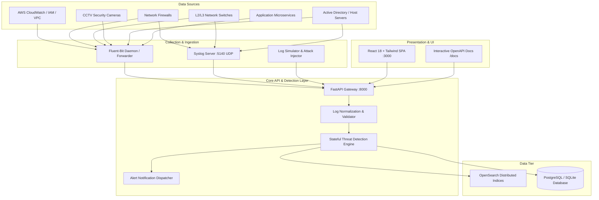

# 🏗️ LogIntel System Architecture & Design Specification

## 1. System Architecture Overview

LogIntel is architected around a modern decoupled microservices & reactive event model:

## 2. Ingestion & Normalization Standard

Every log event from any heterogeneous source is parsed into an RFC-compliant normalized format:

| Field | Type | Description |
| :--- | :--- | :--- |
| `id` | UUID | Unique immutable log event identifier |
| `timestamp` | ISO-8601 UTC | High-precision event occurrence time |
| `source_type` | String | `aws`, `firewall`, `router`, `switch`, `cctv`, `server`, `application` |
| `device_id` | String | Unique hardware / instance identifier |
| `device_name` | String | Human-readable system label |
| `event_type` | String | Standardized action category (`LOGIN_FAILED`, `PORT_SCAN`, `TAMPERING_DETECTED`, etc.) |
| `severity` | String | `info`, `low`, `medium`, `high`, `critical` |
| `source_ip` | IPv4/IPv6 | Originator network address |
| `destination_ip` | IPv4/IPv6 | Target host address |
| `source_port` | Integer | Origin transport port |
| `destination_port`| Integer | Destination service port |
| `protocol` | String | `TCP`, `UDP`, `ICMP`, `HTTPS`, `RTSP`, etc. |
| `action` | String | `ALLOW`, `DENY`, `BLOCK`, `DROP`, `LOGIN_SUCCESS`, `LOGIN_FAILURE`, etc. |
| `username` | String | Identity principal or account name |
| `message` | String | Human-readable event description |
| `metadata` | JSON Object | Custom source-specific key-value payload |

## 3. Threat Detection Rules & Correlation Matrix

| Rule ID | Rule Name | Target Vector | Correlation Window | Threshold | Severity |
| :--- | :--- | :--- | :--- | :--- | :--- |
| `RULE-AUTH-001` | Multiple Failed Logins | Brute-force credentials attack | 60 seconds | 5 failed attempts / IP | **HIGH** |
| `RULE-NET-002` | Port Scan Activity | Multi-port reconnaissance | 60 seconds | ≥ 4 distinct ports / IP | **HIGH** |
| `RULE-NET-003` | Excessive Blocked Connections | Perimeter flood / DoS probing | 60 seconds | ≥ 5 denied packets / IP | **MEDIUM** |
| `RULE-DEV-004` | Critical Device Disconnection | Hardware/link failure | 60 seconds | 1 interface down event | **HIGH** |
| `RULE-CCTV-005` | CCTV Tampering & Sabotage | Physical camera lens occlusion | 60 seconds | 1 tampering event | **CRITICAL** |
| `RULE-AWS-006` | AWS Cloud Privileged Anomaly | Root login / unauthorized IAM | 60 seconds | 1 root login / IAM change | **HIGH** |

## 4. RBAC Permission Matrix

| Feature / Action | Admin | Security Analyst |
| :--- | :---: | :---: |
| View SOC Dashboard & Live KPIs | ✅ | ✅ |
| Search & Filter Logs (Log Explorer) | ✅ | ✅ |
| View & Triage Alerts (Acknowledge / Resolve) | ✅ | ✅ |
| View Devices & Infrastructure Health | ✅ | ✅ |
| Create / Edit / Delete Network Devices | ✅ | ❌ |
| Create / Enable / Disable Detection Rules | ✅ | ❌ |
| Manage User Accounts & Reset Passwords | ✅ | ❌ |
| View Immutable System Audit Trail | ✅ | ❌ |
| Ingest Logs via API & Syslog | ✅ | ✅ |
